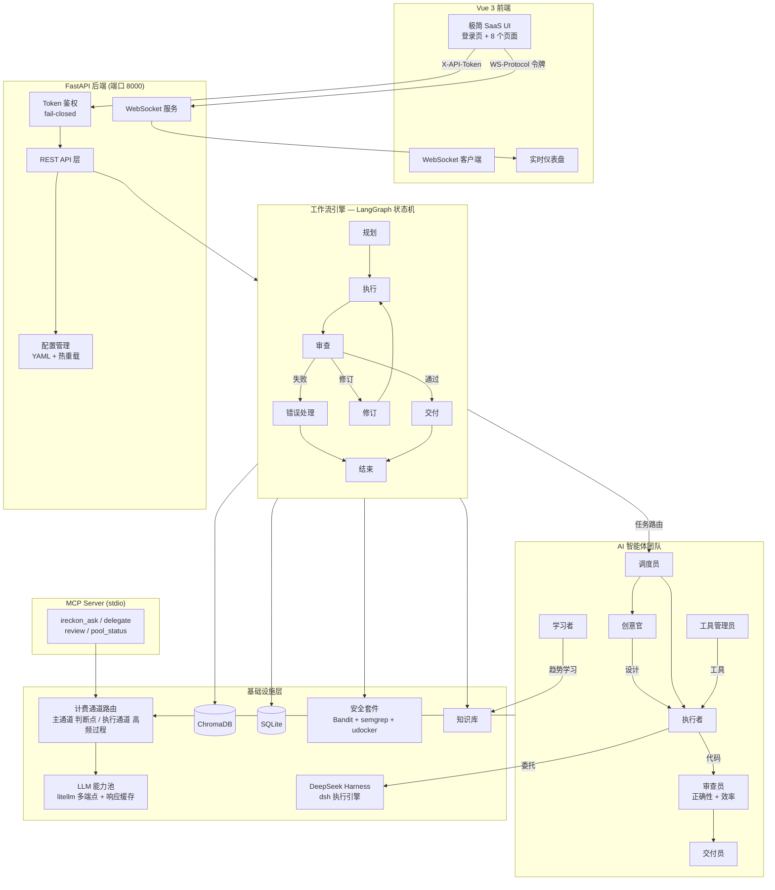

<p style="text-align:center">
  
  
  
  
  
  <br>
  
  
  
</p>

<h1 style="text-align:center">IReckon — 多智能体自主编程系统</h1>
<p style="text-align:center"><em>I think it can work</em></p>

<p style="text-align:center">
  <a href="docs/README_EN.md">English</a> · <a href="docs/BUILD_APK.md">构建 APK</a>
</p>

---

## 概述

**IReckon** 是一个生产级的多智能体 AI 系统，能够将自然语言需求自主转化为完整、经过审查、可交付的软件产物。系统编排一支专业 AI 智能体团队，覆盖标准软件开发生命周期（规划 → 编码 → 审查 → 修订 → 交付），执行过程无需人工干预。

系统基于 **LangGraph 状态机**构建，支持条件路由、循环检测与自动模型升级，在安全沙箱环境中处理完整的软件开发流水线。同时提供 **MCP Server 入口**——外部 host（opencode / Claude Code / Claude Desktop 等）可把 IReckon 当作"专门被工具调用的模型池"，一次 tool call 委托整个子任务。

---

## 系统架构



### 智能体角色

| 角色 | 职责 | 计费通道 |
|------|------|----------|
| **调度员 (Scheduler)** | 将需求拆解为子任务与阶段计划，为每个阶段选择最优智能体 | 主通道 |
| **创意官 (Creative)** | 头脑风暴解决方案，输出技术设计方案 | 主通道 |
| **审查员 (Reviewer)** | 双流水线审查：正确性检查 + 架构/效率分析 | 主通道 |
| **执行者 (Executor)** | 编写、修补、调试和重构代码 — 核心生产力；可委托 dsh 执行引擎 | 执行通道 |
| **交付员 (Deliverer)** | 打包产物，生成交付说明，归档输出 | 执行通道 |
| **学习者 (Learner)** | 空闲时学习：爬取 GitHub Trending，提取开源模式 | 执行通道 |
| **工具管理员 (Tool Manager)** | 管理工具注册表，按需组装自定义工具流水线 | 执行通道 |

### 工作流状态

```
planning ──▶ execute ──▶ review ──┐
                ▲            │     │
                │      ┌─────┘     │
                │      ▼           ▼
                └── revise     deliver ──▶ END

                fail ──▶ handle_error ──▶ END
```

---

## 功能特性

### 核心引擎
- **多智能体编排** — 专业智能体团队，带角色特定提示词和工具访问权限
- **LangGraph 状态机** — 带条件路由、子图和并行执行的正式 DAG，编译图缓存复用
- **双流水线审查** — 正确性（功能）+ 效率（架构）两道关卡
- **自适应模型升级** — 评审轮次较多时自动更换更强的执行 AI
- **循环检测** — 相似度阈值 + 最大轮次限制，防止死循环
- **任务快照与恢复** — 完整状态持久化，支持暂停/恢复/崩溃恢复

### 计费通道分层路由（调用次数套利）
- **主通道 vs 执行通道** — 按次计费的端点只承接判断点（规划/审查/终审），高频中间过程（写码/修补/摘要）折叠进按 token 计费或自托管的执行通道，单任务按次调用从 N 次压缩到 2~4 次
- **响应缓存** — 相同请求直接命中缓存（TTL + 容量上限），带命中统计
- **回退开关** — 执行通道无可用实例时可配置回退主通道（打警告日志）

### MCP Server（模型即 MCP）
- **标准 MCP 工具** — `python mcp_server.py` 以 stdio 传输暴露 4 个工具：
  - `ireckon_ask` — 一次性问答（默认轻量执行通道），适合摘要/分类/抽取等自包含子任务
  - `ireckon_delegate` — 粗粒度委托：整个编码子任务交给 dsh 引擎自主循环完成
  - `ireckon_review` — 审查判定（重量级主通道）：verdict + issues + summary
  - `ireckon_pool_status` — 能力池实例、计费通道划分与缓存命中统计
- **即插即用** — 在 opencode.json / claude_desktop_config.json 中注册即可把 IReckon 当作"被调用的模型池"

### DeepSeek 集成
- **DeepSeek V4 原生支持** — 内置 `deepseek-v4-flash` / `deepseek-v4-pro` 实例，自动启用 thinking mode 与 reasoning_effort
- **DeepSeek Harness (dsh) 执行引擎** — 双通道：Python SDK + headless CLI（`npx @deepseek-ai/dsh`）自动降级
- **独立工作区隔离** — 每个任务在 `data/harness/workspaces/<session_id>` 独立沙箱运行，复用 session_id 可延续持久 Bash 会话
- **安全门** — cordis 策略为 danger-full-access 时必须显式置 `allow_full_access: true`；任务文本命令过滤（L3 高危构造拦截）可通过 `command_filter_enabled` 开关

### 安全体系
- **Web 全局鉴权（fail-closed）** — 所有 `/api/*` 与 `/ws*` 均需令牌：
  - 令牌来源优先级：`IRECKON_API_TOKEN` 环境变量 > `config.yaml` 的 `security.api_token` > 首次启动自动生成随机 token 并持久化
  - 前端登录页粘贴令牌后存入 localStorage（Jupyter/VS Code 模式），HTTP 走 `X-API-Token` 头，WebSocket 走 `Sec-WebSocket-Protocol` 子协议头（`['ireckon.v1', <token>]`，令牌不进 URL）；`?token=` 查询参数仅为旧脚本兼容保留（已弃用）
  - 未配置令牌且绑定非回环地址时拒绝远程访问
- **高危端点强制显式令牌** — 自我进化、自更新等可改写程序自身的操作必须显式携带有效 token（本机回环也不例外）
- **多层命令过滤** — L1 自动执行 / L2 共识投票 / L3 严格拦截
- **静态代码扫描** — 集成 Bandit + semgrep 漏洞检测
- **沙箱执行** — udocker 容器隔离，带资源限制（CPU/内存/网络）
- **供应链防火墙** — pip/npm 包黑名单，依赖来源验证
- **挖矿检测** — 进程命令行模式匹配，运行时异常检测
- **更新包校验** — Release 附 checksums.txt（SHA-256 清单），apply 前强校验，缺失/不匹配一律拒绝（fail-closed）
- **攻击面收敛** — 交互式文档默认关闭（`server.docs_enabled`）、CORS 仅放行本机固定来源、SPA 回退带路径穿越防护、异常详情不回显客户端

### LLM 与 AI 基础设施
- **模型无关** — 通过 litellm 支持 100+ 模型（OpenAI, Anthropic, Google, Azure, Ollama, vLLM 等）
- **智能能力池** — 多端点管理、健康检查、熔断器、冷却机制、自动故障转移
- **流式 + 降级** — 自动流式降级、指数退避重试、每端点速率限制
- **成本追踪** — 每任务 token 核算、预算强制执行、月度配额告警

### 前端
- **极简 SaaS 设计系统** — 克制的边框/阴影、Indigo 强调色、深浅双主题，Linear/Notion 质感
- **登录页** — 令牌校验通过后解锁控制台，令牌仅存浏览器 localStorage
- **实时 WebSocket 流** — 任务进度、日志和消息实时推送（心跳保活 + 自动重连）
- **Markdown 消息渲染** — marked + DOMPurify（XSS 过滤）+ highlight.js 代码高亮
- **8 个页面** — 聊天 / 任务表格 / 仪表盘 / 系统日志 / 交付产物 / AI 实例 / 自我进化 / 设置
- **多视觉主题** — catgirl / programmer 主题，深浅色模式
- **响应式布局** — 桌面/平板/移动端自适应

### DevOps
- **配置热重载** — YAML 修改通过 watchdog 实时生效
- **空闲自学习** — 无任务时自动爬取 GitHub Trending
- **自更新系统** — 分析 → 修改 → PR 推送自动化循环
- **Docker 部署** — 多阶段构建（Node 构建前端 + Python 后端），compose 一键起
- **Windows 桌面打包** — PyInstaller + pywebview 嵌入式窗口（随机端口自通信，不占固定端口不开浏览器）；Inno Setup 单文件安装程序（见 `scripts/build_exe.bat` / `deploy/installer.iss`）
- **CI** — GitHub Actions：lint/mypy/bandit + Linux/Windows 双平台 pytest + 冒烟测试 + 前端构建

---

## 快速开始

### 环境要求
- Python 3.10+
- Node.js 18+（前端开发/构建用）
- LLM 端点（默认: `http://localhost:3003/v1` — FreeLLM API，可自行配置）

### 安装

```bash
git clone https://github.com/Ameiro-sudo/IReckon.git
cd IReckon
pip install -r requirements.txt
# 开发/测试额外依赖：
pip install -r requirements-dev.txt

# 准备配置（config.yaml 含密钥不入库，首次启动也可由系统自动生成）
cp config/config.example.yaml config/config.yaml
cp .env.example .env   # 填入真实 API Key
```

### 配置 LLM

```bash
# DeepSeek V4 官方 API（能力池内置 deepseek-v4-flash / deepseek-v4-pro 实例）
export DEEPSEEK_API_KEY=sk-xxx

# 可选：FreeLLM API（config 默认实例）/ OpenCode Zen 免费模型
export FREELMAPI_KEY=xxx
export OPENCODE_API_KEY=xxx

# 或自定义：在 config/config.yaml 的 ai_pool.instances 中增改端点
```

能力池配置见 `config/config.yaml` 的 `ai_pool` 段；计费通道划分用 `channel:execution` 标签标注执行通道实例；dsh 执行引擎见 `harness` 段（mode: auto 优先 SDK、缺失时降级 CLI）。密钥推荐用 `${ENV_VAR}` 占位符引用 `.env`。

### 启动

```bash
# 一键启动（自动构建/托管前端，端口 8000）
python main.py

# 生产模式（FastAPI 托管构建后的前端，前后端同端口）
./scripts/run.sh

# 手动启动
cd frontend && npm run build
python -m uvicorn app.web.api:app --host 0.0.0.0 --port 8000

# 开发模式（独立 Vite dev server :3000 + 后端 :8000）
IRECKON_DEV_FRONTEND=1 python main.py

# Docker 部署
cd deploy && docker compose up -d --build

# MCP Server（供 opencode / Claude Desktop 等调用）
python mcp_server.py
```

> 提示：`python main.py` 会检测 `frontend/dist`，不存在时自动启动 Vite dev server（:3000）并安装前端依赖。

### 登录与访问

首次启动会在控制台横幅打印自动生成的 API 访问令牌（`irk_...`），打开前端后在登录页粘贴即可。也可在 `config/config.yaml` 的 `security.api_token` 固定，或设置环境变量 `IRECKON_API_TOKEN`。

| 服务 | 地址 |
|------|------|
| Web 服务（前端 + API 同端口） | `http://127.0.0.1:8000` |
| 前端 UI（开发模式） | `http://127.0.0.1:3000` |
| 健康检查（免鉴权） | `http://127.0.0.1:8000/api/health` |

> 交互式文档默认关闭以收敛攻击面；开发时可在 `server.docs_enabled` 打开后访问 `/docs`。

---

## API 参考

所有 `/api/*` 接口需携带 `X-API-Token` 请求头（豁免：`/api/health`、`/api/themes`、`/api/auth/check`）；WebSocket 以 `Sec-WebSocket-Protocol: ireckon.v1, <token>` 握手鉴权（服务端只回显 `ireckon.v1`，令牌不进 URL/访问日志；旧版 `?token=` 查询参数兼容保留但已弃用）。标 ⚠ 的高危端点必须显式配置并携带有效令牌。

### 任务

| 方法 | 路径 | 说明 |
|------|------|------|
| POST | `/api/tasks` | 创建新任务 |
| GET | `/api/tasks` | 获取任务列表（`?limit&offset&status` 分页筛选） |
| GET | `/api/tasks/{id}` | 获取任务详情（含计划、看板、Token 用量） |
| GET | `/api/tasks/{id}/board` | 获取任务看板状态 |
| GET | `/api/tasks/{id}/artifacts` | 列出交付产物 |
| GET | `/api/tasks/{id}/artifact?path=` | 读取单个产物文件内容（路径穿越防护） |
| GET | `/api/tasks/{id}/download` | 下载交付产物 (zip) |
| POST | `/api/tasks/{id}/cancel` | 取消运行中的任务 |
| POST | `/api/tasks/{id}/resume` | 恢复暂停/失败的任务 |
| DELETE | `/api/tasks/{id}` | 删除任务（级联清理消息/看板/快照） |
| GET | `/api/tasks/{id}/messages` | 获取任务消息 |
| POST | `/api/tasks/{id}/messages` | 发送消息到任务 |

### AI 实例与配置

| 方法 | 路径 | 说明 |
|------|------|------|
| GET | `/api/ai-instances` | 列出 AI 端点（密钥脱敏返回） |
| POST | `/api/ai-instances` | 注册新 AI 端点 |
| PUT | `/api/ai-instances/{id}` | 更新 AI 端点（部分更新基于现有实例合并） |
| DELETE | `/api/ai-instances/{id}` | 删除 AI 端点 |
| POST | `/api/ai-instances/{id}/test` | 测试端点连通性 |
| GET | `/api/capabilities` | 能力池状态 |
| GET | `/api/config` | 获取当前配置 |
| POST | `/api/config/update` | 运行时更新配置（原子写入） |
| GET | `/api/themes` | 获取 UI 主题列表（免鉴权） |

### 系统

| 方法 | 路径 | 说明 |
|------|------|------|
| GET | `/api/auth/check` | 校验令牌有效性（登录页用，免鉴权） |
| GET | `/api/health` | 健康检查（含版本/更新/连接数/运行时长，免鉴权） |
| GET | `/api/stats` | 仪表盘统计（任务状态分布/AI 实例/用量） |
| GET | `/api/usage` | Token/成本用量汇总 |
| GET | `/api/logs` | 最近系统日志 |
| POST | `/api/uploads` | 上传文件（任务附件） |
| POST | `/api/self-improve` ⚠ | 触发自我进化分析 |
| POST | `/api/self-improve/push` ⚠ | 推送自我进化分支 |
| GET | `/api/update/check` | 检查新版本 |
| POST | `/api/update/apply` ⚠ | 应用更新 |
| WS | `/ws/{task_id}` | 按任务的实时事件流 |
| WS | `/ws` | 全局事件流（日志/消息） |

---

## 技术栈

| 层 | 技术 |
|----|------|
| 语言 | Python 3.10+ (asyncio) |
| LLM 接口 | litellm（100+ 模型）+ DeepSeek V4 原生 |
| 计费路由 | 主/执行双通道分层 + 响应缓存 |
| MCP | mcp SDK (FastMCP, stdio 传输) |
| 执行引擎 | DeepSeek Harness (dsh) — SDK / headless CLI |
| 工作流引擎 | LangGraph |
| 向量数据库 | ChromaDB |
| 关系数据库 | SQLite (aiosqlite) |
| 后端框架 | FastAPI + WebSocket |
| 前端框架 | Vue 3 + Vite + Pinia |
| 配置管理 | YAML + 环境变量 + watchdog |
| 日志系统 | loguru |
| 安全扫描 | Bandit, semgrep |
| 容器沙箱 | udocker |
| 数据加密 | cryptography (Fernet) |
| 桌面窗口 | pywebview（打包版嵌入式窗口） |
| CI/CD | GitHub Actions（Linux + Windows 矩阵） |
| 打包工具 | PyInstaller, Inno Setup, Buildozer |

---

## 项目结构

```
IReckon/
├── main.py                       # 应用入口（初始化/生命周期/嵌入式桌面模式）
├── mcp_server.py                 # MCP Server 启动器（stdio，日志让路 stderr）
├── pyproject.toml                # 项目元数据 + 工具链配置（ruff/mypy/bandit/coverage）
├── requirements.txt              # 运行依赖
├── requirements-dev.txt          # 开发依赖（pytest/ruff/mypy 等）
├── buildozer.spec                # Buildozer (Android/Kivy) 打包配置
├── .env.example                  # 环境变量示例（API Keys / IRECKON_API_TOKEN）
│
├── app/                          # 后端包（py.typed，PEP 561）
│   ├── mcp_server.py             # MCP 工具实现（ask/delegate/review/pool_status）
│   ├── agents/                   # AI 智能体（scheduler/creative/executor/reviewer/deliverer/learner/tool_manager/content_filter）
│   ├── core/                     # 基础设施（配置/数据库/日志/状态/更新）
│   ├── engine/                   # 工作流引擎（LangGraph 状态机/看板/会议室/自我进化/循环检测）
│   ├── harness/                  # DeepSeek Harness (dsh) 集成
│   ├── llm/                      # LLM 基础设施（能力池/计费通道路由/响应缓存/客户端）
│   ├── knowledge/                # 知识管理（文件 + 向量）
│   ├── security/                 # 安全子系统（命令过滤/扫描/沙箱/挖矿检测/供应链防火墙）
│   ├── tools/                    # 工具系统（注册表/组装器 + builtin 工具包）
│   ├── utils/                    # 通用工具
│   └── web/                      # Web 层
│       ├── api.py                # FastAPI 应用工厂（鉴权挂载 + SPA 托管 + CORS）
│       ├── auth.py               # Token 鉴权（fail-closed / 高危端点严格令牌）
│       ├── push.py               # WebSocket 推送（心跳保活）
│       └── routers/              # 按领域拆分的路由（tasks/instances/config/system/uploads）
│
├── frontend/                     # Vue 3 前端（Vite + Pinia + marked/highlight.js）
│   ├── src/
│   │   ├── views/                # 登录页 + 8 个页面（聊天/任务/仪表盘/日志/产物/AI实例/自我进化/设置）
│   │   ├── components/           # 组件（NewTaskModal/ArtifactBrowser/LogViewer/TaskBoardPanel/...）
│   │   ├── stores/               # Pinia 状态（任务/看板/实时消息/Toast）
│   │   └── utils/markdown.js     # Markdown 渲染 + XSS 过滤 + 代码高亮
│   └── dist/                     # 构建产物（FastAPI 托管）
│
├── config/                       # 配置（config.example.yaml 模板 / prompts / themes / harness）
├── scripts/                      # 工具脚本（run.sh 启动器 / build_exe 打包 / 测试 / Makefile）
├── tests/                        # pytest 测试套件（43 个模块）
├── docs/                         # 文档（README_EN / BUILD_APK / CODE_REVIEW / UNATTENDED_LOG）
├── deploy/                       # Docker / Inno Setup 部署
└── data/                         # 运行时数据（db/logs/states/output/harness）
```

---

## 开发指南

```bash
# 安装依赖
pip install -r requirements-dev.txt
cd frontend && npm install

# 代码检查
ruff check app/
ruff format --check app/
mypy app/

# 安全扫描
bandit -r app/ -ll

# 格式化
ruff format app/

# 测试
pytest tests -q
python scripts/smoke_test.py
python scripts/test_run.py
```

---

## 开源许可

基于 **MIT License** 分发，详见 [`LICENSE`](LICENSE) 文件。

---

<p style="text-align:center">
  <sub>IReckon Team 用心打造</sub>
</p>
